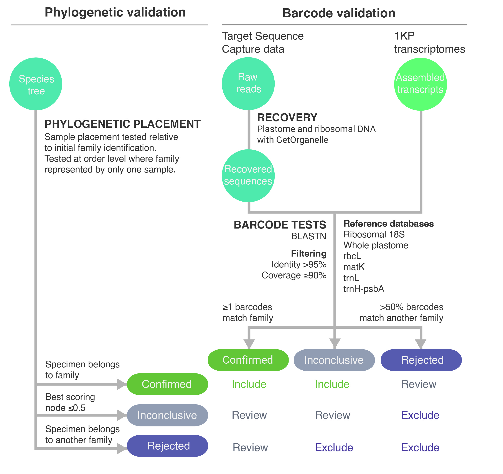

# PAFTOL Validation Pipeline
* [Barcode Validation](#barcode-validation)
  + [Samples](#samples)
    - [Angiosperms 353](#angiosperms-353)
    - [Public assemblies](#public-assemblies)
  + [Taxonomic standardization](#taxonomic-standardization)
  + [Barcode Tests](#barcode-tests)
  + [Validation](#validation)
  + [Dependencies](#dependencies)

- [Phylogenetic Validation](#phylogenetic-validation)
- [Validation Decisions](#validation-decisions)

We implemented two validation steps, ran in parallel to verify the family of samples included in the Tree Of Life: 

* 1) an *in-silico* DNA barcode validation, which uses plastid and nuclear ribosomal data for DNA-based identification.
* 2) a phylogenetic validation, which checks the placement of each sample at family level in a preliminary tree relative to its expected position. 




## Barcode Validation
To improve the testability and accuracy of the validation procedure—due to partial recovery of organellar DNA and uneven coverage across families for reference barcodes—Height individual barcode reference databases were built from the NCBI nucleotide and BOLD databases ([https://www.ncbi.nlm.nih.gov/nuccore; ](https://www.ncbi.nlm.nih.gov/nuccore)https://www.boldsystems.org/, accessed on 02/08/2021), one for the whole plastome (Refseq_pt), and the remaining six for specific loci (ribosomal 18S, ITS2, as well as plastid *rbc*L,  *rbc*La, *mat*K, 23s, 16s).
The creation and curation of barcode databases is described in detail [here](Barcode_Databases/)

### Samples
#### Angiosperms 353
For **PAFTOL**, **SRA** & **GAP** samples, plastomes and ribosomal DNA were recovered from raw reads using `GetOrganelles` (Jin et al. 2020). In both cases, recommended parameters were used (https://github.com/Kinggerm/GetOrganelle#recipes; i.e. -R 20 -k 21,45,65,85,105 for plastomes, and -R 10 -k 35,85,115 for nuclear ribosomes). Our GetOrganelle script is in [PAFTOL_Get_Organelle](PAFTOL_Get_Organelle/)

#### Public assemblies
Validation by barcoding was also performed on transcriptomes of the **One Thousand Plant Transcriptomes Initiative** (Leebens-Mack et al. 2019), as well as from coding sequences of **Annotated Genomes** and contigs of **Unannotated Assemblies**. 

### Taxonomic standardization

Species names of all samples and all barcode databases were all standardized against the **World Checklist of Vascular Plants** (https://wcvp.science.kew.org/)  using a [custom python script](WCVP_Taxo/).

### Barcode Tests

Sample sequences were queried against barcode databases using `BLASTn` (Camacho et al. 2009), only if their family was present in the database. BLAST results were further filtered with a minimum identity >95%, and minimum coverage or length of the reference locus as shown below. 

| **Barcode** | **Min. length** | Min. coverage | **type** |
| :---------: | :-------------: | :-----------: | :------: |
| BOLD\_rbcLa |                 |      80       |  cpDNA   |
| BOLD\_rbcL  |                 |      80       |  cpDNA   |
| BOLD\_matK  |                 |      80       |  cpDNA   |
| BOLD\_ITS2  |                 |      80       |   rDNA   |
|  NCBI\_23s  |                 |      80       |  cpDNA   |
|  NCBI\_16s  |                 |      80       |  cpDNA   |
|  NCBI\_18s  |                 |      80       |   rDNA   |
| Refseq\_pt  |      1000       |               |  cpDNA   |


```shell
# Command used to run the barcode validation on OneKP and PAFTOL samples
sbatch Barcode_Validation.sh 2021-07-05_paftol_export.csv 'OneKP'
sbatch Barcode_Validation.sh 2021-07-05_paftol_export.csv 'PAFTOL'
```

Up to height barcode tests were thus performed per sample. A sample passed an individual test if the first ranked `BLASTn` match (ranked by identity or by bitscore) confirmed its original family identification, and failed otherwise. Note that controls could only be completed if the specimen’s family was present in the barcode databases and if at least one `BLASTn` match remained after filtering. 

### Validation

The final result of the barcode validation following the height individual barcode tests were determined as follows:  

1. Confirmed: One or more barcode test confirm the family identification of a sample.
2. Rejected: More than ½ of the barcode tests confirm the same incorrect family identification (requires at least two barcode tests).
3. Inconclusive otherwise.

The barcode validation scripts can be found [here](Barcode_Validation/)

### Dependencies

```python
- entrez-direct 
- seqkit
- cutadapt
- blast
- python3
	- Pandas
	- Numpy
	- Bio
	- TQDM
	- Seaborn
```

# Phylogenetic Validation
To conduct phylogenetic validation, a preliminary phylogenetic tree was built using the complete, unvalidated release dataset, following the phylogenetic methods described [here](Phylogenetic_Validation/). We then assessed which nodes best represents each family in the tree. For every node in the tree, two metrics were calculated: firstly, the proportion of samples belonging to the taxon that subtend the node, and secondly, the proportion of samples subtending the node that belong to the taxon. The two metrics were multiplied to produce a combined score, and for each family, the highest scoring node was subsequently considered to best represent the taxon in the tree (allowing the identification of outlying samples). Where a node has a value of 1, the taxon that it represents is monophyletic in the tree.

The phylogenetic validation of family identification of each sample was determined as:

1. Confirmed: if belonging to the family whose best scoring node had a value >0.5 and found under this node, 
2. Rejected: if identified as belonging to the family whose best scoring node had a value >0.5 but not falling under the node 
3. Inconclusive: if belonging to the family whose best scoring node had a value of ≤0.5.

Note that for families represented in the a tree by a single sample, the validation was performed with respect to their orders. If the order was represented by a single sample, the validation result was coded as inconclusive.

The phylogenetic validation script can be found [[here](Phylogenetic_Validation/)]

# Validation Decisions
The outputs of the phylogenetic and barcoding validation were combined to identify specimens for automatic inclusion and exclusion from the final tree, and where a decision on inclusion/exclusion was subject to expert review (see figure above).
